***

## ENG Version 🇺🇸 | [RU Версия 🇷🇺](/README.ru.md)

**Status:** Pre-Alpha \
**Minecraft Version:** 1.20.1 \
**Mod ID:** `hbm_m`

***

## 📥 Official Platforms

#  <a href="https://discord.gg/kYW4JBtUDn">Discord</a> |  <a href="https://modrinth.com/mod/hbms-nuclear-tech-modernized">Modrinth</a> |  <a href="https://www.curseforge.com/minecraft/mc-mods/hbms-nuclear-tech-modernized">CurseForge</a> 

> [!WARNING]
> **This mod is in pre-alpha stage.**
> **DO NOT use it in your important worlds!**
> Bugs, crashes, and mod incompatibilities are possible.
> Report issues at [GitHub Issues](../../issues)

***

## About the Mod

A modern reimagining of the legendary HBM's Nuclear Tech Mod for Minecraft 1.20.1. Nuclear technologies, radiation, advanced weaponry, and industrial automation with a rewritten codebase and improved architecture.

***

## ⚡ Key Features

**Radiation System** — realistic irradiation mechanics with chunk-based spread, player accumulation, and dangerous effects

**Industrial Automation** — multiblock machines for resource processing and energy production

**Advanced Equipment** — armor and tools with unique perks and modifiers

**Energy System** — generation, storage, and transmission of electricity between machines

**Hazard System** — includes radioactivity, pyrophoricity, explosiveness, and more

***

## 🏭 Industry and Machines

### Multiblock Structures

Craft complex industrial machines consisting of multiple blocks for efficient resource processing.

**Assembly Machines** — two varieties for crafting automation and component production, with an advanced recipe and template system

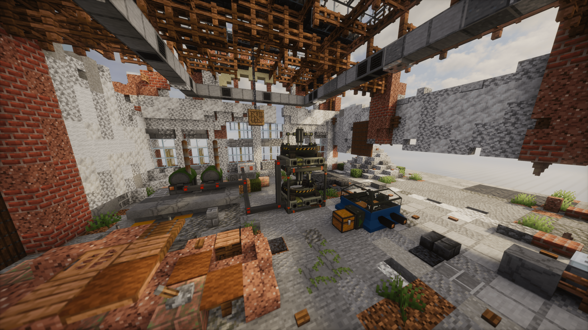

**Press** — creating materials under pressure

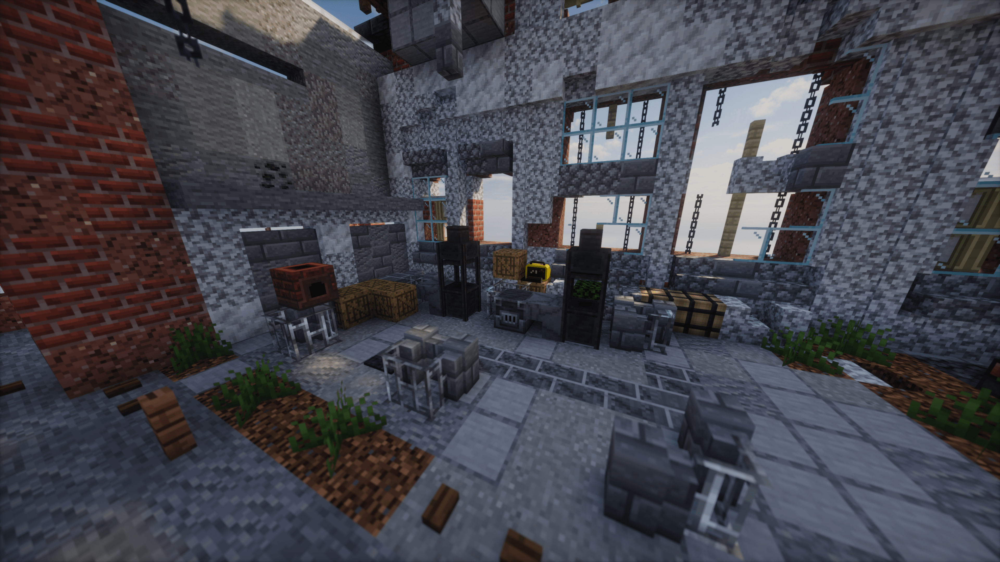

**Wood-Burning Generator** — primary energy source in the early game

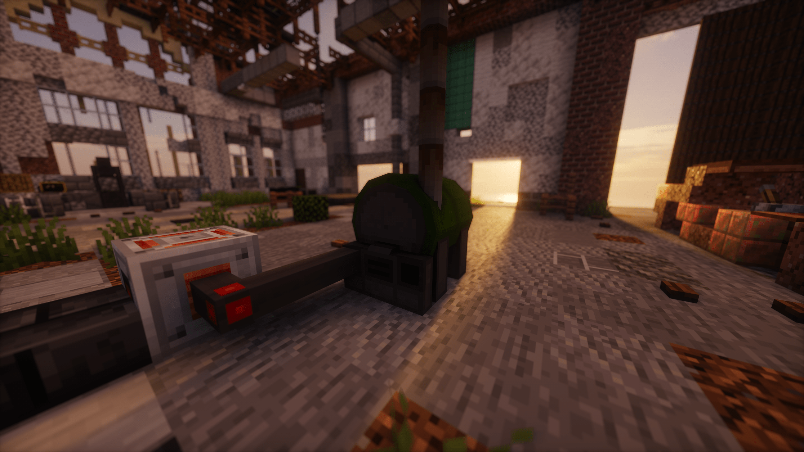

### Energy System

A complete system for generating, storing, and transmitting electricity to power industrial machines.

**Generators** — various methods of obtaining energy from wood to radioactive fuel

**Energy Storage** — accumulators for electricity backup

**Cables** — energy transmission between devices

***

## 🛠️ Materials and Resources

### Metallurgy

Dozens of new ingots and metal blocks for crafting advanced equipment.

**Radioactive Materials** — uranium, plutonium, polonium, and many others for nuclear technologies

**Advanced Alloys** — special materials for powerful equipment

**Ores** — new ore types with world generation

**Creative Tabs:** Blocks | Consumables | Fuel | Tools | Machines | Ores | Resources | Parts | Templates | Weapons

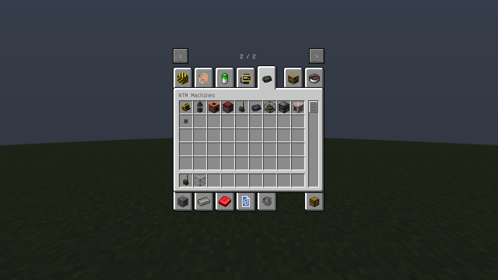

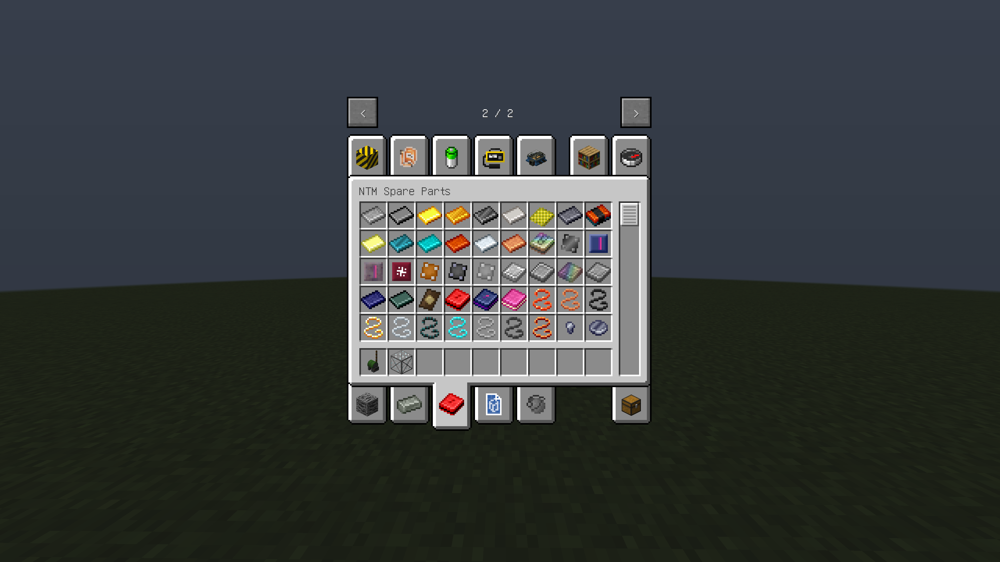

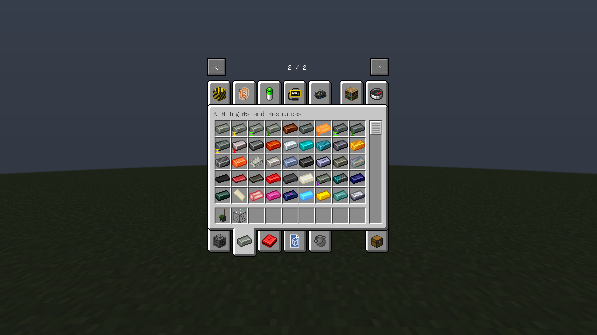

-----

***

## ⚔️ Equipment and Gear

### Armor with Perks

Advanced armor sets with unique modifiers and abilities.

**Perk System** — upgrade armor through the modification table to gain special effects

**Radiation Protection** — special sets for working with hazardous materials

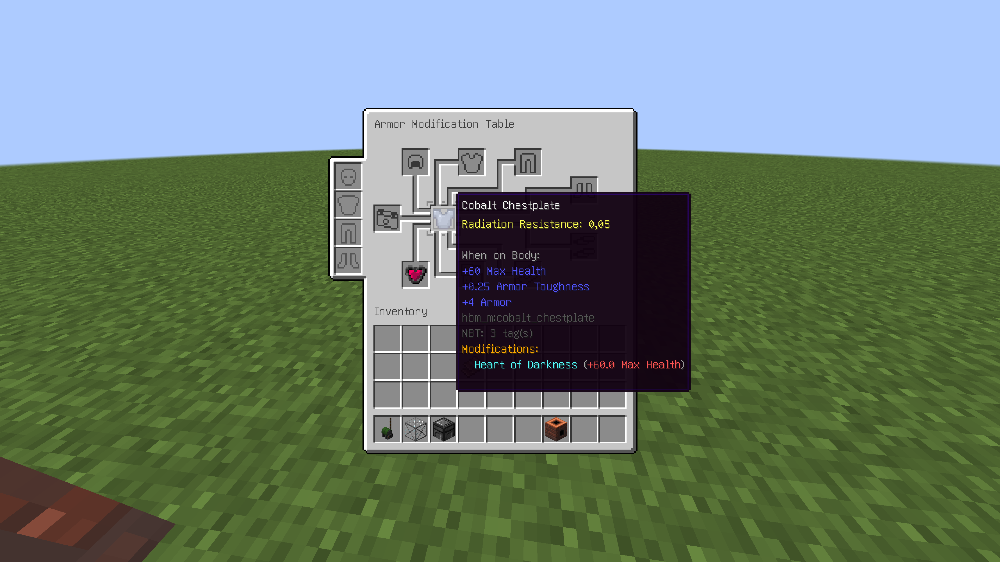

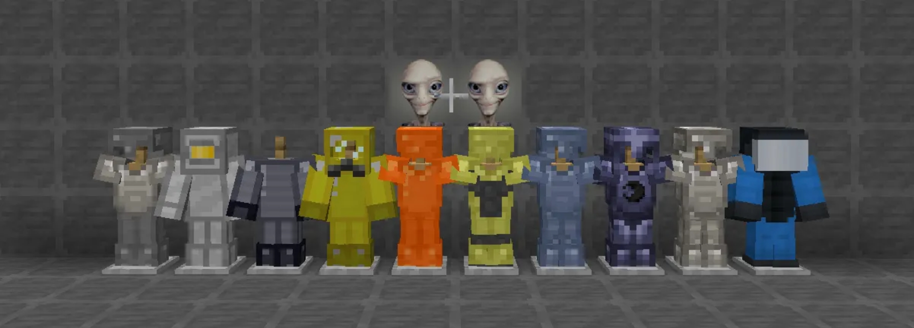

### Tools

Powerful tools with unique resource mining mechanics.

**Vein Miner** — mines entire ore veins at once

**Advanced Tools** — increased efficiency and durability

**Weapons** — swords and axes from various materials, as well as several types of grenades

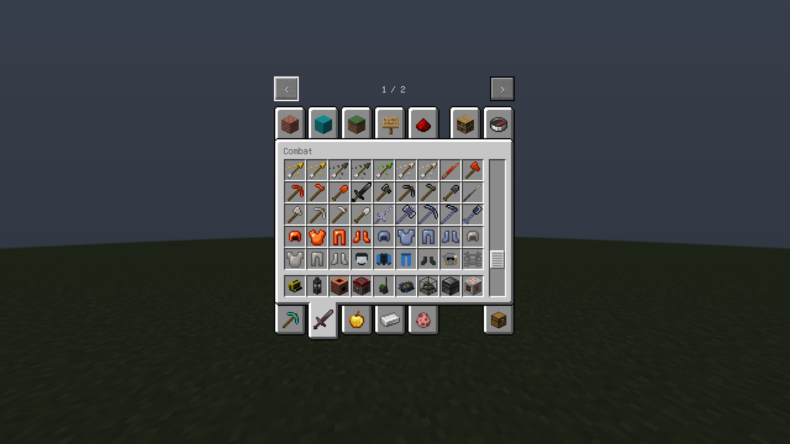

***

## ☢️ Radiation System

Realistic irradiation mechanics affecting gameplay and the surrounding world.

### Irradiation Mechanics

**Radiation Accumulation** — from the environment and radioactive items in inventory

**Chunk-based Spread** — radiation spreads and slowly dissipates over time

**Irradiation Effects** — blindness, confusion, weakness, hunger, poisoning, and death at critical doses

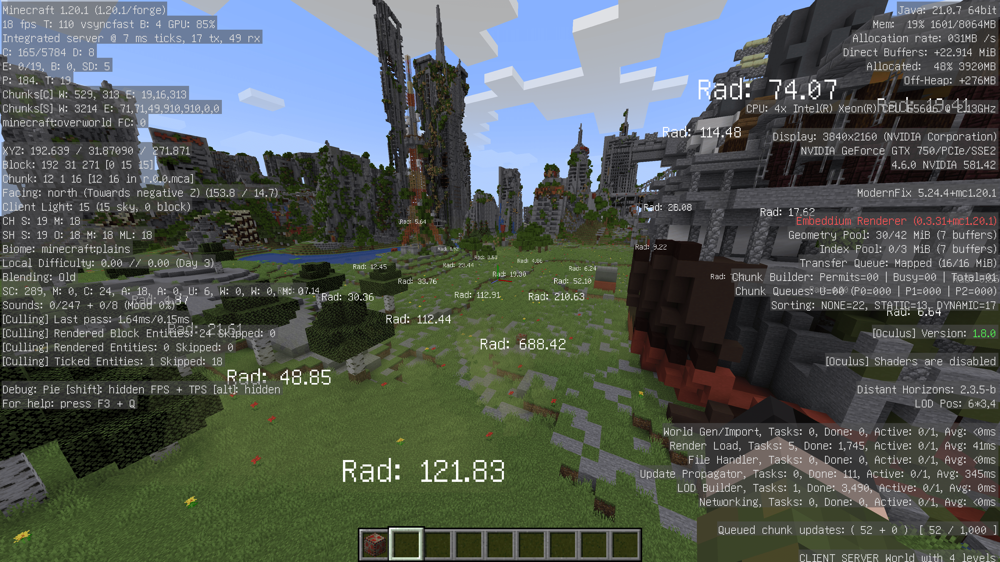

### World Impact

**Block Mutations** — grass and foliage transform into dead variants at high radiation levels

**Radioactive Blocks** — emit radiation into surrounding chunks

### Measuring Devices

**Geiger Counter** — precise radiation measurement with sound accompaniment and HUD indication

**Dosimeter** — simple device for quick radiation level assessment

### Hazard System

**Explosiveness** — don't throw gunpowder and dynamite into fire, or there might be a boom
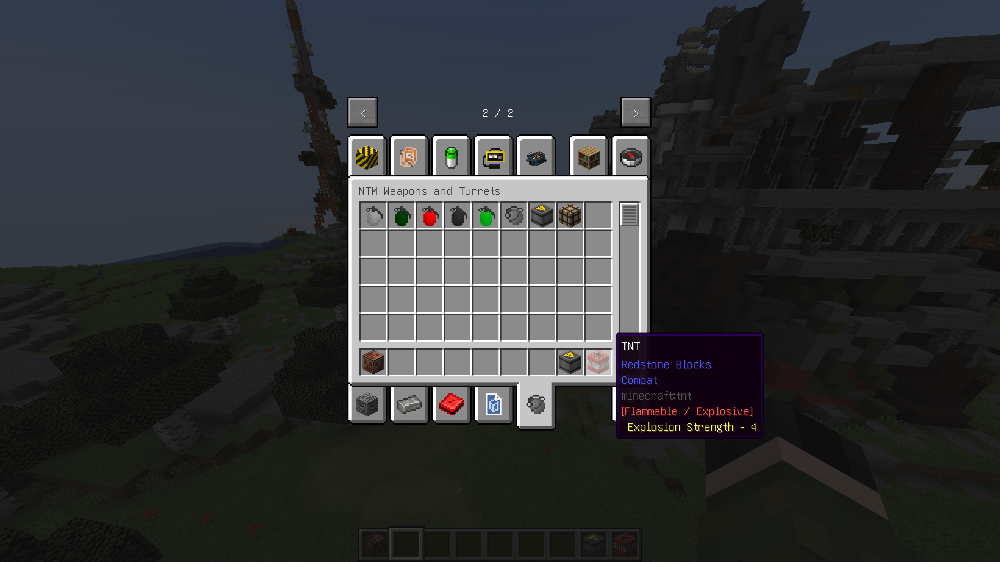

**Radioactivity** — corresponding items and blocks emit radiation

**Pyrophoricity** — don't handle this without fire protection

***

## 🎮 Game Systems

### Commands

`/hbm_m rad` — manage player radiation level (add/remove/clear)

### Settings

Deep integration with Cloth Config API for fine-tuning mod parameters.

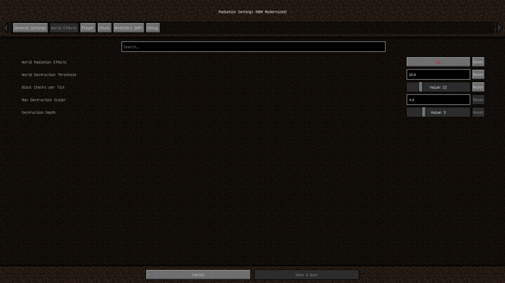
***

## 📦 Installation

**Requirements:**

- Minecraft 1.20.1
- Forge 1.20.1
- [Cloth Config API v1.11.136+](https://www.curseforge.com/minecraft/mc-mods/cloth-config/files?version=1.20)

**Steps:**

1. Download the latest version from [Releases](../../releases)
2. Install Cloth Config API for version 1.20.1
3. Place both `.jar` files in the `mods` folder
4. Launch Minecraft with Forge 1.20.1

***

## ⚠️ Known Issues

**Pre-alpha version** — expect bugs, incomplete features, and possible world corruption

**Compatibility** — not tested with most mods, conflicts are possible

**Crafting** — some recipes are missing, survival is temporarily unavailable

Report issues at [Issues](../../issues) with detailed descriptions.

***

## 🤝 Contributing

Pull requests, suggestions, and bug reports are welcome!

Fork the repository and propose improvements.

***

## 💝 Acknowledgments

**The Bobcat** — author of the original HBM's Nuclear Tech Mod

**Raptor324, Hyperio \& Razchexlitiel** — modernization and rework

The Forge team and Mojang for development tools

***

## 📝 Note

We are learning as we develop, please be patient!
Thank you for your interest in the mod and constructive feedback.

---

