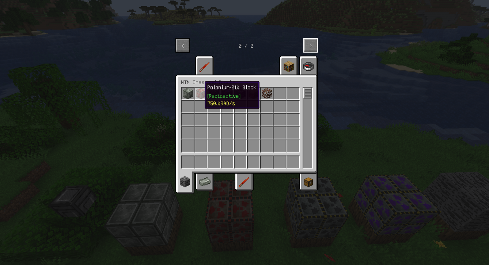
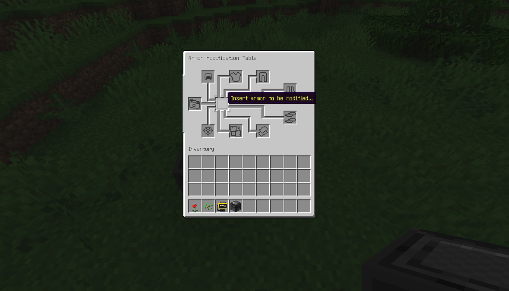
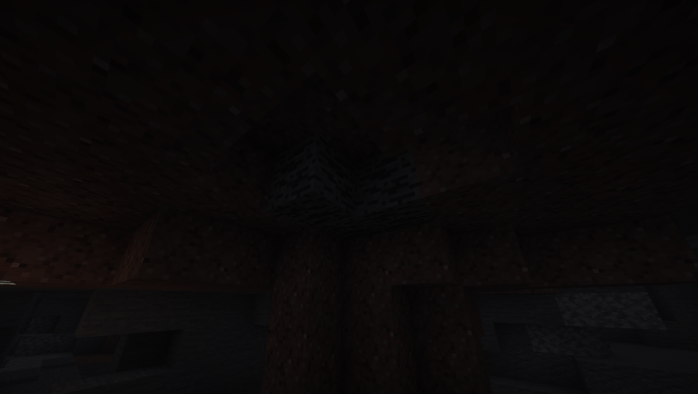

# Hbm's Nuclear Tech Mod Modernized

## ENG Version 🇺🇸 | [RU Версия 🇷🇺](/README.ru.md)

**Status:** Pre-Alpha \
**Minecraft Version:** 1.20.1\
**Mod ID:** `hbm_m`

---

## ⚠️ Warning

> **This mod is currently in early alpha stage.**
> **Do NOT use it in worlds you care about!**
> There may be bugs, crashes, and potential incompatibilities with other mods.
> Please report any issues via the [GitHub Issues](../../issues) page.

-----

## About
This is a modernized rewrite of the classic Hbm's Nuclear Tech Mod, aiming to bring nuclear technology, radiation, and advanced weaponry to Minecraft 1.20.1+ with a fresh codebase and improved architecture. Work in progress!

### 🟢 [Modrinth](https://modrinth.com/mod/hbms-nuclear-tech-modernized) | 🔨 [Curseforge](https://www.curseforge.com/minecraft/mc-mods/hbms-nuclear-tech-modernized)

## Dependency
[Cloth Config API v1.11.136](https://www.curseforge.com/minecraft/mc-mods/cloth-config/files?version=1.20)

**Note:**
I'm new to Minecraft modding, so please don't judge too harshly!
Constructive feedback and bug reports are very welcome.
All crafts are currently missing, not playable in survival mode.

-----

## Features (Alpha Preview)

  - **Custom Creative Tabs:**
      - Resources, Fuel, Templates, Ores, Machines, Bombs, Missiles, Weapons, Consumables. (Not all of them are filled, so there are gaps in the creative menu)

      

  - **Items:**
      - **Advanced Alloy Sword:** A powerful custom sword.
      - **Uranium Ingot:** Radioactive material.
      - **Geiger Counter:** Detects environmental and inventory radiation, with sound and HUD overlay (WIP).
      - **Dosimeter:** A simpler device compared to the Geiger counter. It only shows the approximate environmental radiation.

  - **Blocks:**
    - **Uranium Block**
    - **Plutonium Block**
    - **Plutonium Fuel Block**
    - **Polonium-210 Block**
        - Emit radiation into the chunk
    - **Dead Grass and Foliage** - Part of the world destruction system

    
    - **Armor Modification Table** - WIP. The block itself and a correct GUI are implemented.

    

    - **Uranium Ore** - Generates naturally in the world.

    

  - **Radiation System:**
      - Players accumulate radiation from the environment and inventory.
      - Radiation effects: blindness, confusion, weakness, hunger, poison, and even death at high doses.
      - Radiation is persistent and saved per player.
      - Chunk-based radiation system with spread and decay.
      - Radioactive blocks increase chunk radiation.
      - Debug overlay for chunk radiation (creative/spectator mode by default).
      - Mutation and block decay system - at high radiation doses in a chunk, foliage and grass blocks will be replaced with their dead counterparts.

      
      
      

  - **Sounds:**
      - Geiger counter clicks when there is radiation around.

  - **Commands:**
      - `/hbm_m rad` for manipulating player radiation (add, remove, clear).
      

  - **Advancements**
    - **Hooray, Radiation!** Reach a radiation level of 200 RAD.
    - **Ouch, Radiation!** Die from radiation sickness.
      

  - **Client Features:**
      - Debug chunk radiation renderer (toggleable).

      
      - Deep Cloth Config API integration, so you can easily tweak core mod settings. (This is a required dependency for now, but I might make it optional in the future.)

      
-----

## Installation

1.  Download the latest version from [Releases](../../releases).
2.  Download the [Cloth Config API](https://www.curseforge.com/minecraft/mc-mods/cloth-config/files?version=1.20).
      - Make sure you download the version compatible with Minecraft 1.20.1.
3.  Place both `.jar` files into your Minecraft `mods` folder.
4.  Launch Minecraft with Forge 1.20.1.

-----

## Known Issues & Compatibility

  - **Alpha quality:** Expect bugs, missing features, and possible world corruption.
  - **Mod compatibility:** Not tested with other mods. Conflicts may occur.

If you encounter any problems, please report them on the [Issues](../../issues) page with details.

-----

## Contributing

Pull requests, suggestions, and bug reports are welcome!
If you want to help, feel free to fork the repository or submit pull requests.

-----

## Credits
  - Original Hbm's Nuclear Tech Mod created by **The Bobcat**.
  - The Forge team and Mojang for their work on Minecraft.
  - Modernization and rewrite by [Raptor324].

-----

## Final Note
Please be patient and understanding—I'm learning as I go!
Thank you for trying out the mod and helping with feedback.
