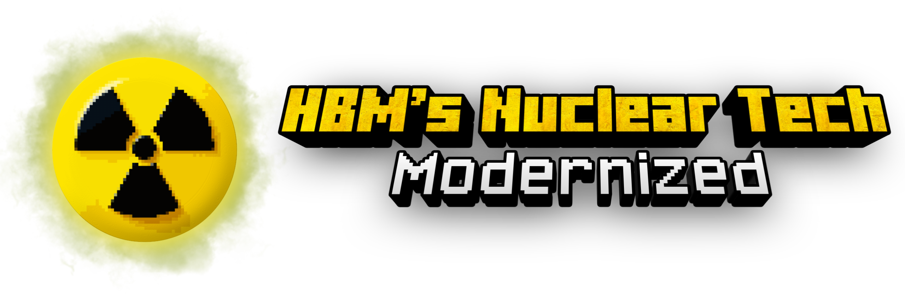

***

## ENG Version 🇺🇸 | [RU Версия 🇷🇺](/README.ru.md)

**Status:** Pre-Alpha \
**Minecraft Version:** 1.20.1 \
**Mod ID:** `hbm_m` \
**License:** GPL-3.0-only (with retained LGPL-3.0 for upstream 1.7.10 material - see [License](#-license))

***

## 📥 Official Platforms

<div align="center">

#  <a href="https://discord.gg/f2BhvzG6CS">Discord</a> |  <a href="https://modrinth.com/mod/hbms-nuclear-tech-modernized">Modrinth</a> |  <a href="https://www.curseforge.com/minecraft/mc-mods/hbms-nuclear-tech-modernized">CurseForge</a> 
</div>

> [!WARNING]
> **This mod is in pre-alpha stage.**
> **DO NOT use it in your important worlds!**
> Bugs, crashes, and mod incompatibilities are possible.
> Report issues at [GitHub Issues](../../issues)

***

## About

HBM-Modernized is a modernized rework of [Hbm's Nuclear Tech Mod](https://github.com/HbmMods/Hbm-s-Nuclear-Tech-GIT) for Minecraft 1.20.1: nuclear technology, radiation, advanced weaponry, and industrial automation, rebuilt on a modern codebase and rendering architecture.

The project is an independent port and is not an official release of HBM/NTM.

***

## Source And Attribution

This project is a modified and modernized work derived from **[Hbm's Nuclear Tech Mod](https://github.com/HbmMods/Hbm-s-Nuclear-Tech-GIT)** for Minecraft 1.7.10. **The Bobcat and the original HBM/NTM contributors retain credit and copyright** in the original code, assets, gameplay design, and documentation.

All modernization work - the 1.20.1 codebase, build system, rendering architecture, and cross-version platform layer - is authored by the HBM-Modernized team (see [gradle.properties](gradle.properties) for the contributor list).

Detailed attribution is in [NOTICE.md](NOTICE.md).

***

## 📄 License

This project is licensed under **[GPL-3.0-only](LICENSE)**.

Licensing by scope:

| Scope | License |
|---|---|
| Combined HBM-Modernized source and JAR | GPL-3.0-only |
| Material derived from HBM/NTM 1.7.10 (code, assets, mechanics, docs) | LGPL-3.0-only - original notice retained ([LICENSE.LESSER](LICENSE.LESSER)) within the GPLv3 combined work |
| HBM-Modernized's own additions and modifications | GPL-3.0-only |
| Dependencies (Minecraft, Forge/NeoForge, Architectury, etc.) | Their own upstream licenses |

Notes:

- Applying GPLv3 to the combined work does not erase upstream copyright or the LGPL-3.0 notice on the migrated portions.
- The `license` field in `mods.toml` states `GPL-3.0-only` - the effective license of the combined distributable mod. It is intentionally not a compound expression (`GPL AND LGPL` would incorrectly claim every part is under both licenses; `GPL OR LGPL` would incorrectly offer an LGPL-only option for our own GPLv3 material).
- `LICENSE`, `LICENSE.LESSER`, and `NOTICE.md` are shipped inside release JARs under `META-INF/`.
- Distributing a compiled JAR requires making the complete corresponding source - including build scripts - available by a GPLv3-compliant method. The canonical source repository is this one.

***

## 🏗️ Building

The project uses a single source set with [stonecutter](https://stonecutter.kikoz.dev/) preprocessing for multi-version support. Active targets: `1.20.1-forge` and `1.21.1-neoforge`.

```bash
./gradlew "Set active project to 1.21.1-neoforge"   # switch active stonecutter project
./gradlew "Reset active project"   # reset active stonecutter project to 1.20.1-forge - by default. Do always before any commit.
./gradlew :1.20.1-forge:build      # build the JAR
./gradlew :1.20.1-forge:runClient  # launch a dev client
./gradlew :1.20.1-forge:runData    # run data generation (translations, blockstates, etc)
```

The same applies to `1.21.1-neoforge`. The Gradle compiler is the only build authority - the preprocessor actively transforms sources per target.

***

## 📦 Installation

1. Install **Forge 1.20.1**
2. Download the latest version from [Releases](../../releases)
3. Place the `.jar` in your `mods` folder

***

## 🤝 Contributing

Pull requests, suggestions, and bug reports are welcome. Fork the repository and propose improvements, or report issues at [Issues](../../issues) with detailed descriptions.

***

## 💝 Acknowledgments

**The Bobcat** - author of the original HBM's Nuclear Tech Mod

**RaptorDev / Raptor324** and other contributors - modernization and rework

The Forge and Mojang teams for development tools
