## RU Версия 🇷🇺 | [ENG Version 🇺🇸](/README.md)

**Статус:** Пре-Альфа  
**Версия Minecraft:** 1.20.1  
**Mod ID:** `hbm_m`

---

## 📥 Официальные площадки

#  <a href="https://discord.gg/f2BhvzG6CS">Discord</a> |  <a href="https://modrinth.com/mod/hbms-nuclear-tech-modernized">Modrinth</a> |  <a href="https://www.curseforge.com/minecraft/mc-mods/hbms-nuclear-tech-modernized">CurseForge</a> |  <a href="https://vk.com/hbm_modernized">VK</a>

> [!WARNING]
> **Мод находится на стадии пре-альфа.**  
> **НЕ используйте его в важных для вас мирах!**  
> Возможны баги, краши и несовместимость с другими модами.  
> Сообщайте о проблемах в [GitHub Issues](../../issues)

---

## О моде

Современная переработка легендарного HBM's Nuclear Tech Mod для Minecraft 1.20.1. Ядерные технологии, радиация, передовое вооружение и промышленная автоматизация с переписанной кодовой базой и улучшенной архитектурой.

---

## ⚡ Ключевые особенности

**Система радиации** - реалистичная механика облучения с распространением по чанкам, накоплением игроками и опасными эффектами

**Промышленная автоматизация** - мультиблочные машины для переработки ресурсов и производства энергии

**Продвинутая экипировка** - броня и инструменты с уникальными перками и модификаторами

**Энергетическая система** - генерация, хранение и передача электроэнергии между машинами

**Система опасностей** - включает в себя радиоактивность, пирофорность, взрывоопасность и тд.

---

## 🏭 Промышленность и машины

### Мультиблочные структуры

Создавайте сложные промышленные установки состоящие из нескольких блоков для эффективной переработки ресурсов.

**Сборочные машины** - две разновидности для автоматизации крафта и производства компонентов, с продвинутой системой рецептов и шаблонов

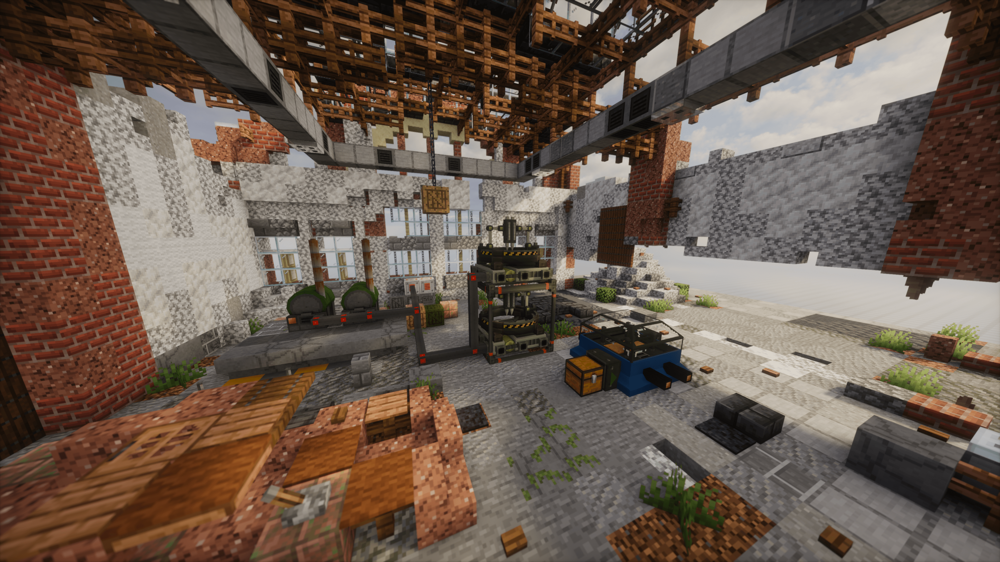

**Пресс** - создание материалов под давлением
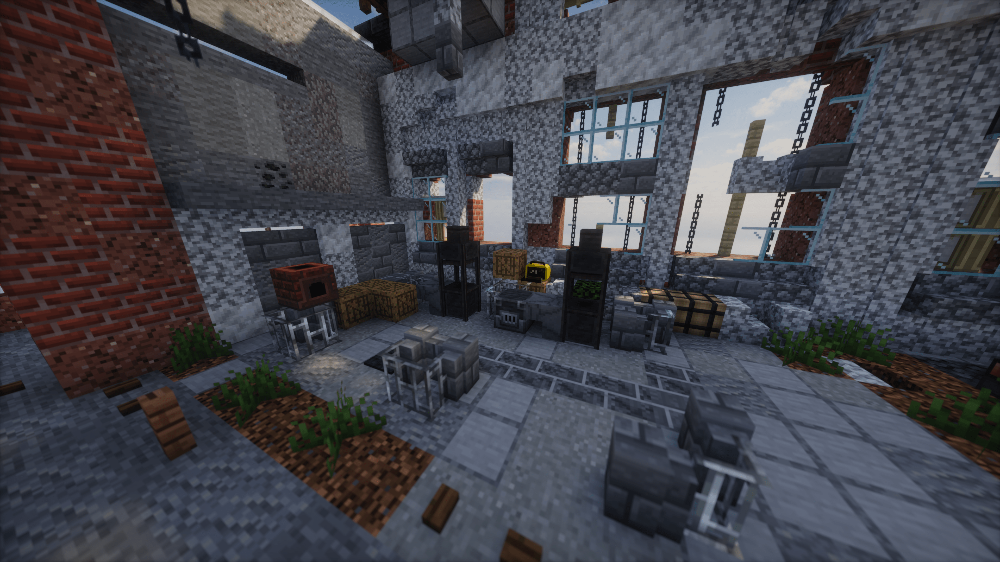

**Дровяной генератор** - первичный источник энергии на раннем этапе игры
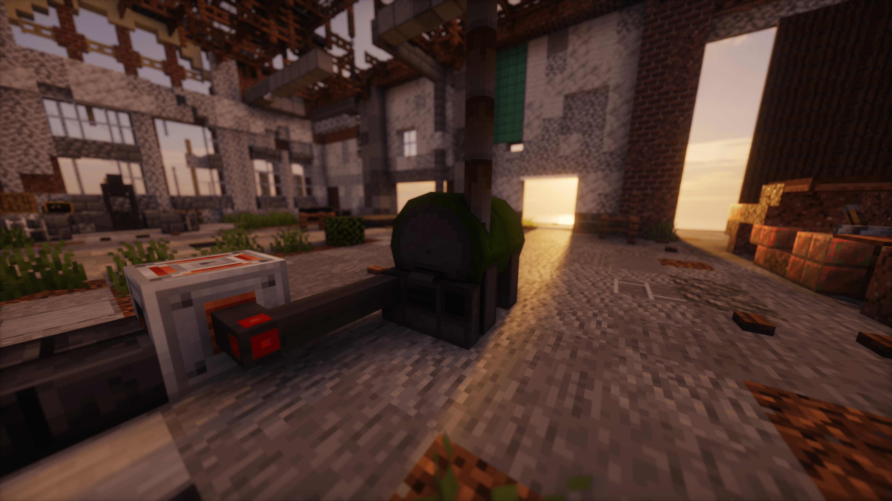

### Энергетическая система

Полноценная система генерации, хранения и передачи электричества для питания промышленных машин.

**Генераторы** - различные способы получения энергии от дров до радиоактивного топлива

**Хранилища энергии** - накопители для резервирования электричества

**Кабели** - передача энергии между устройствами

---

## 🛠️ Материалы и ресурсы

### Металлургия

Десятки новых слитков и блоков металлов для крафта продвинутого оборудования.

**Радиоактивные материалы** - уран, плутоний, полоний и множество других для ядерных технологий

**Продвинутые сплавы** - специальные материалы для мощного оборудования

**Руды** - новые виды руд с генерацией в мире

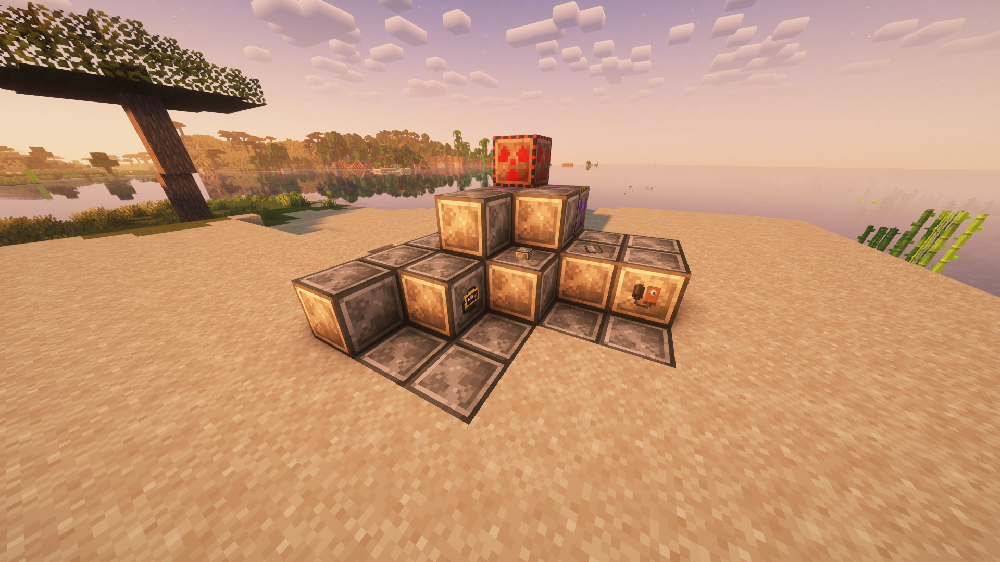

**Творческие вкладки:** Блоки | Расходники | Топливо | Инструменты | Механизмы | Руды | Ресурсы | Запчасти | Шаблоны | Оружие

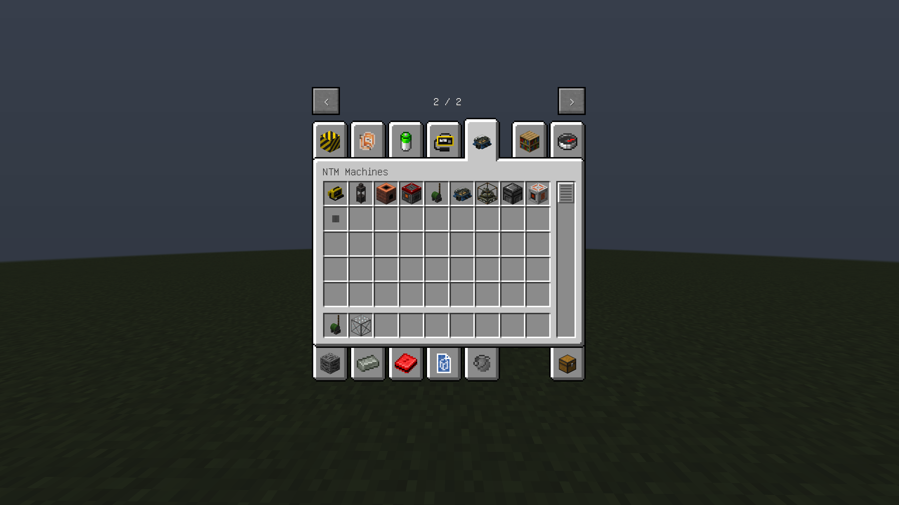

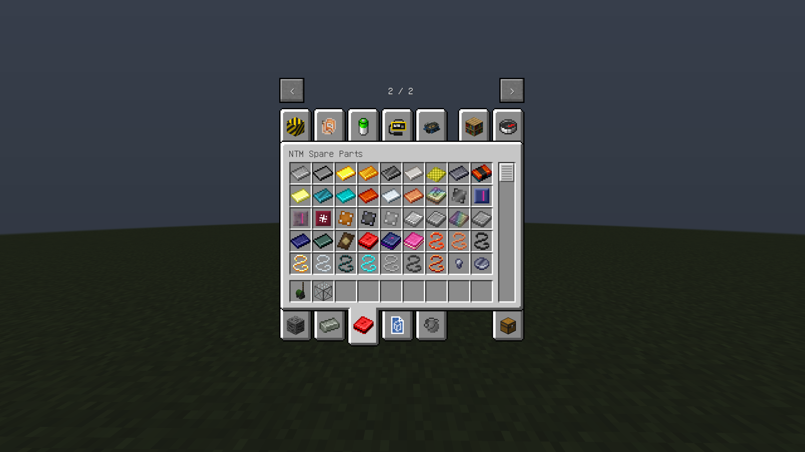

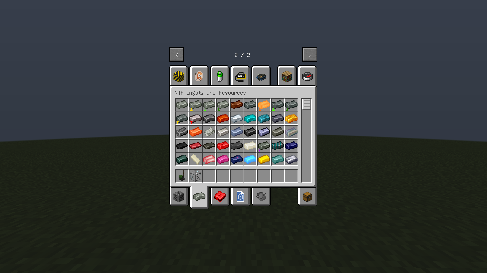

---

## ⚔️ Экипировка и снаряжение

### Броня с перками

Продвинутые комплекты брони с уникальными модификаторами и способностями.

**Система перков** - улучшайте броню через стол модификации для получения специальных эффектов

**Радиационная защита** - специальные комплекты для работы с опасными материалами

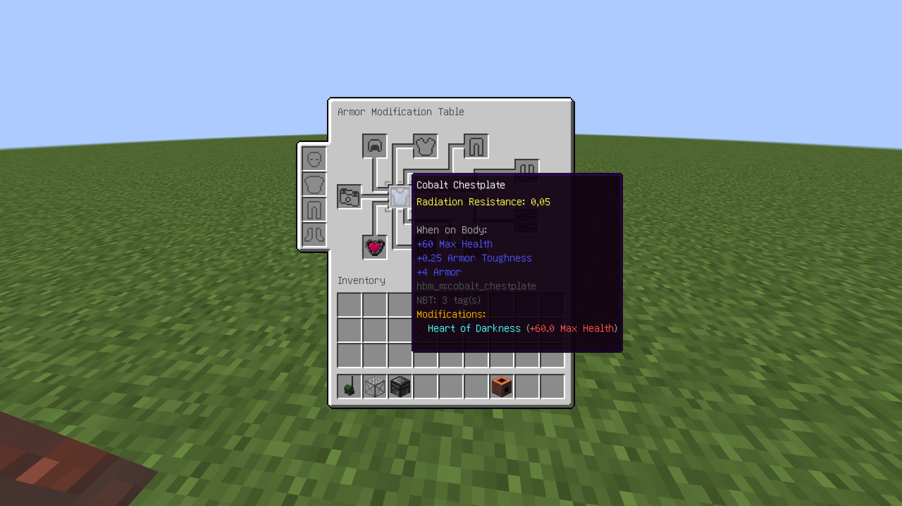

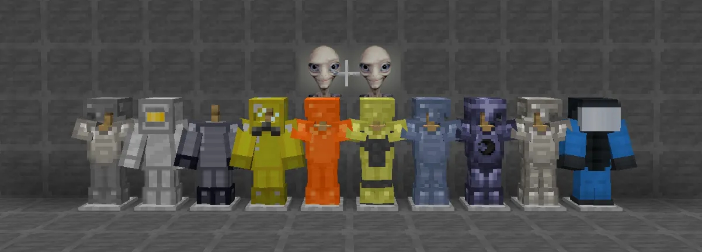

### Инструменты

Мощные инструменты с уникальными механиками добычи ресурсов.

**Жилковый майнер** - добывает целые жилы руды за раз

**Продвинутые инструменты** - повышенная эффективность и долговечность

**Оружие** - мечи и топоры из различных материалов, а так же несколько видов гранат!

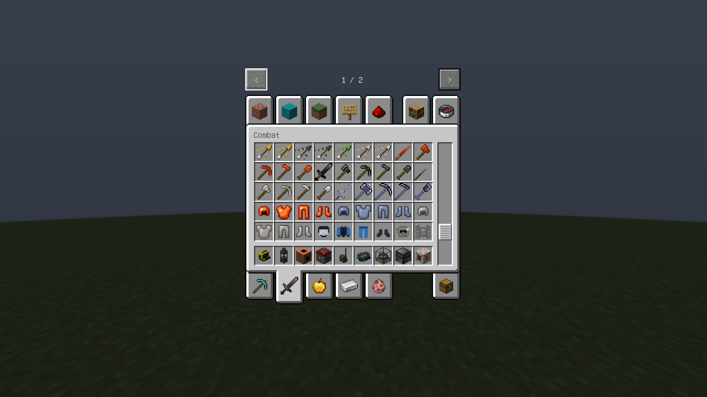

---

## ☢️ Система радиации

Реалистичная механика облучения, влияющая на игровой процесс и окружающий мир.

### Механика облучения

**Накопление радиации** - из окружающей среды и радиоактивных предметов в инвентаре

**Распространение по чанкам** - радиация распространяется и медленно рассеивается со временем

**Эффекты облучения** - слепота, замешательство, слабость, голод, отравление и смерть при критических дозах

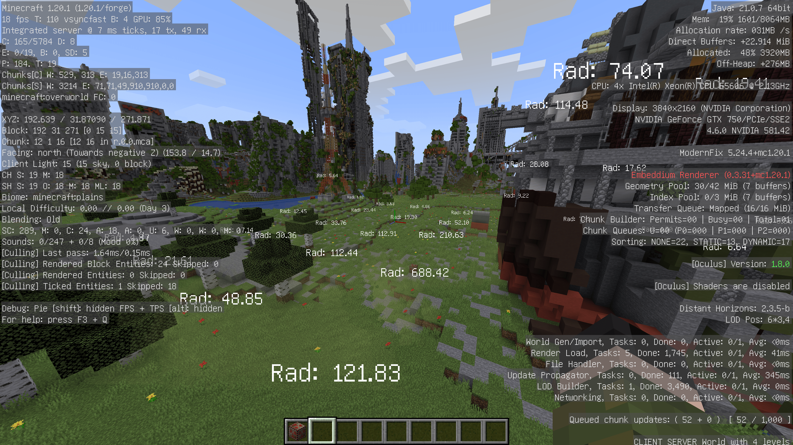

### Влияние на мир

**Мутации блоков** - трава и листва превращаются в мертвые аналоги при высоком уровне радиации

**Радиоактивные блоки** - излучают радиацию в окружающие чанки

### Измерительные приборы

**Счетчик Гейгера** - точное измерение радиации с звуковым сопровождением и HUD-индикацией

**Дозиметр** - простое устройство для быстрой оценки уровня радиации

### Система опасностей

**Взрывоопасность** - не стоит кидать порох и динамит в огонь, иначе может случиться бабах!
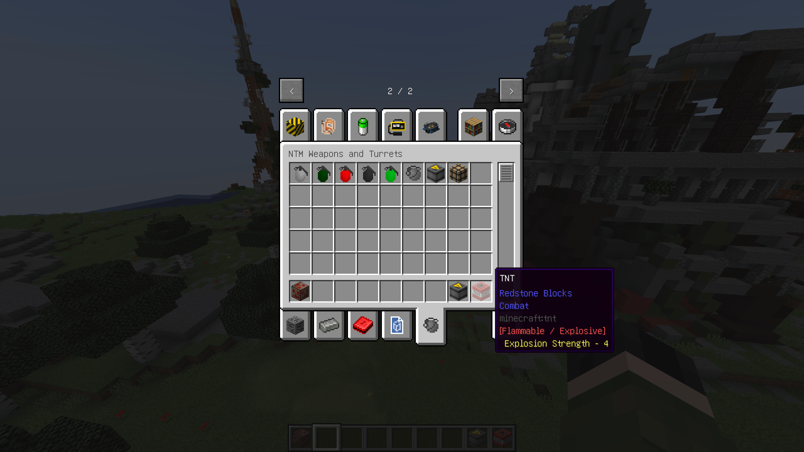
**Радиоактивность** - соответствующие предметы и блоки излучают радиацию.\
**Пирофорность** - без огнезащиты брать это в руки не стоит!

---

## 🎮 Игровые системы

### Команды

`/hbm_m rad` - управление уровнем радиации игрока (добавить/удалить/очистить)

### Настройки

Глубокая интеграция с Cloth Config API для тонкой настройки параметров мода.

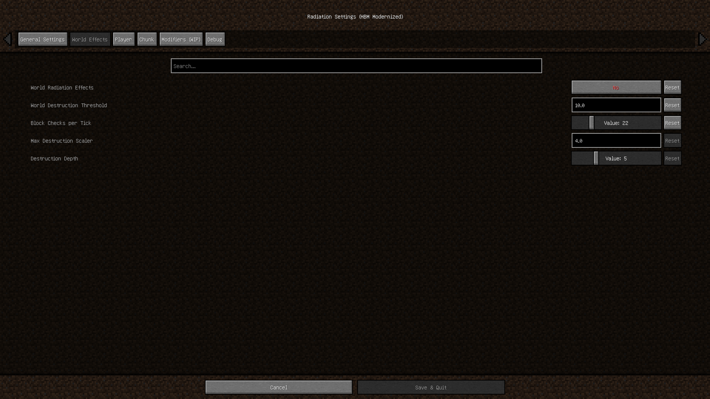

---

## 📦 Установка

**Требования:**
- Minecraft 1.20.1
- Forge 1.20.1
- [Cloth Config API v1.11.136+](https://www.curseforge.com/minecraft/mc-mods/cloth-config/files?version=1.20)

**Шаги:**
1. Скачайте последнюю версию из [Releases](../../releases)
2. Установите Cloth Config API для версии 1.20.1
3. Поместите оба `.jar` файла в папку `mods`
4. Запустите Minecraft с Forge 1.20.1

---

## ⚠️ Известные проблемы

**Пре-альфа версия** - ожидайте баги, недоработанные функции и возможную порчу мира

**Совместимость** - не тестировалось с большинством модов, возможны конфликты

**Крафты** - часть рецептов отсутствует, выживание временно недоступно

Сообщайте о проблемах в [Issues](../../issues) с подробным описанием.

---

## 🤝 Участие в разработке

Pull requests, предложения и баг-репорты приветствуются! 

Форкайте репозиторий и предлагайте улучшения.

---

## 💝 Благодарности

**The Bobcat** - автор оригинального HBM's Nuclear Tech Mod

**Raptor324** - модернизация и переработка

Команде Forge и Mojang за инструменты разработки

---

## 📝 Заметка

Мы учимся в процессе разработки, будьте терпеливы!  
Спасибо за интерес к моду и конструктивную обратную связь.

---